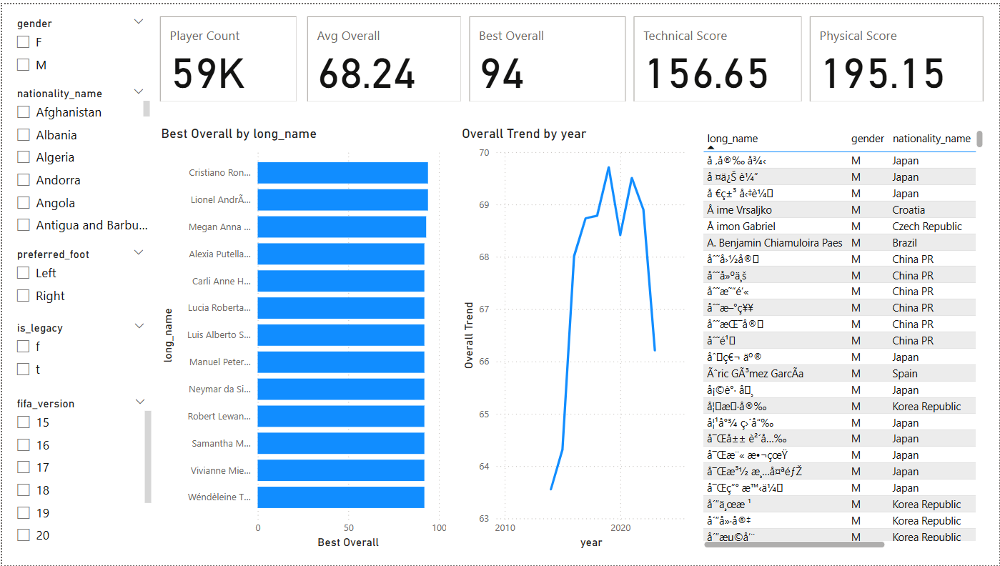
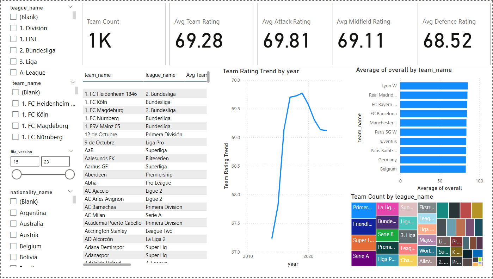
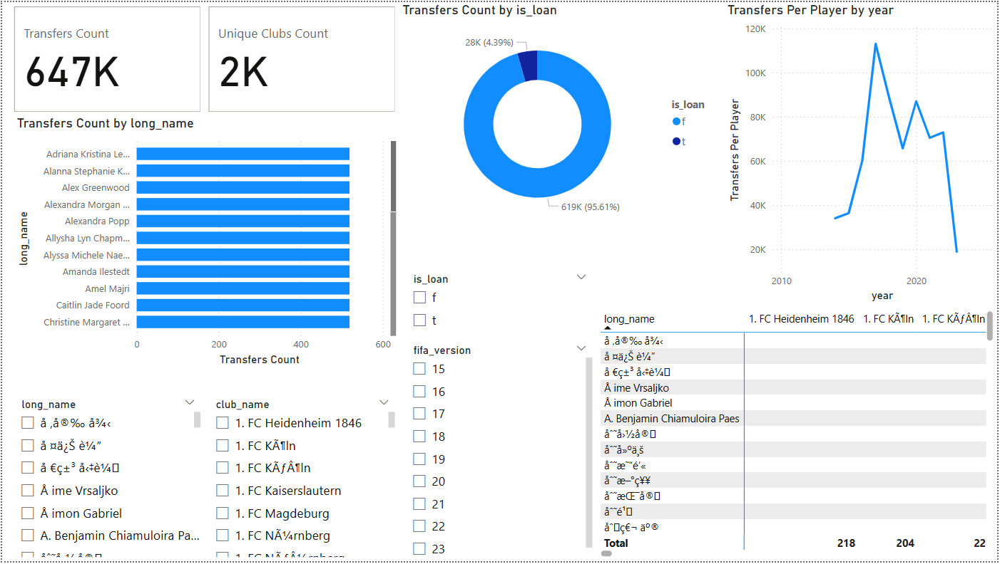

# ⚽ FIFA Analytics Data Warehouse & Power BI Dashboard

End-to-End ETL • PostgreSQL Data Warehouse • Power BI Dashboards • DAX KPIs

This project builds a complete sports analytics system using a custom dimensional data warehouse, Python ETL pipeline, and interactive Power BI dashboards to analyze FIFA player performance, team ratings, and club transfer history.

---

## 🚀 Project Overview

This system simulates a real-world analytics workflow including:

* Data ingestion & cleaning (Python, Pandas)
* Data modeling using a Star Schema (PostgreSQL)
* Building dimensions & fact tables (5 dims, 3 facts)
* DAX-based KPIs & visualizations (Power BI)
* End-to-end transfer, performance, and team analytics

---

## 📊 Architecture

dim_coach → dim_team → fact_team_ratings
dim_league → dim_team
dim_player → fact_player_attributes
dim_team → fact_player_club_history
dim_date → all fact tables

---

## 🗂️ Data Warehouse Schema

### Dimensions

* **dim_player** – Player profile (name, nationality, attributes)
* **dim_team** – Team metadata, league, and coach
* **dim_coach** – Coach information
* **dim_league** – League lookup
* **dim_date** – Standard date dimension

### Facts

* **fact_player_attributes** – Player attributes per FIFA version
* **fact_team_ratings** – Team ratings by version/date
* **fact_player_club_history** – Transfers, club history, loan info

---

## 🔧 Tech Stack

* PostgreSQL
* Python (Pandas)
* Power BI
* DAX
* SQL
* ETL

---

## 📁 Repository Structure

data/ → All dimension & fact CSVs
sql/ → DDL, DML, validation scripts
python/ → ETL & cleaning notebooks/scripts
powerbi/ → PBIX dashboard file
images/ → Dashboard screenshots
README.md → Project documentation

---

## 🔄 ETL Pipeline (Python)

* Cleaned 200k+ rows of player, team, league, and rating data
* Fixed duplicates, missing values, inconsistent formats
* Generated surrogate keys and merged datasets
* Exported clean UTF-8 datasets for PostgreSQL

---

## 🗄️ SQL Implementation

Includes:

* CREATE TABLE scripts (dims + facts)
* COPY load scripts
* Primary/foreign key configuration
* Data integrity validation queries
* Orphan key detection
* Star schema relationship validation

---

## 📊 Power BI Dashboards

### ✔ Player Dashboard

* Top 10 players
* Attribute trends
* Player profile slicers
* Technical & physical KPIs

---

### ✔ Team Ratings Dashboard

* Team ranking
* Attack/Midfield/Defense KPIs
* League distribution
* Rating trend line

--=

### ✔ Club History Dashboard

* Transfers & loans
* Player–club matrix
* Transfer timeline
* Club movement insights
  

---

## 🔢 DAX Measures

Includes KPIs such as:

* Player Rank
* Avg Overall Rating
* Team Trend
* Transfer Count
* Unique Clubs Count
* Technical Score
* Physical Score
* Attack/Midfield/Defense averages

---

## 🎯 Project Highlights

* Built a 5-dimension, 3-fact data warehouse from scratch
* Designed ETL pipeline using Python + Pandas
* Implemented 18+ DAX measures
* Delivered 3 interactive Power BI dashboards
* Demonstrated end-to-end BI + Data Engineering workflow

---

## Links

* Dataset: [Dataset](https://drive.google.com/drive/folders/1G8gPP6t0DSDxsu4JpW8DOsGolPiREc1r?usp=drive_link)
* Power BI: [Fifa Analytics Dashboard](https://drive.google.com/file/d/1scgbGoe3W2zJA5obM0uVZ1NOVwU6e2QT/view?usp=sharing)

---

## 📝 How to Use

1. Load CSV files from the `/data` folder
2. Execute SQL scripts in `/sql` to build the warehouse
3. Open `fifa_dashboard.pbix` in Power BI
4. Refresh data to generate insights

---
